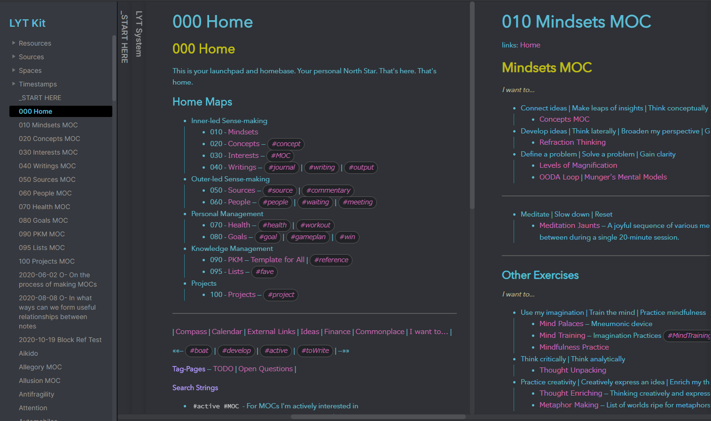

<!-- history area start -->

commit history

<ol>
<li>2020/11/22 21:38:52 9c8e710</li>
<li>2020/11/22 21:33:26 2a5c5ff</li>
</ol>

<!-- history area end -->
<!-- toc area start -->

headline

<!-- toc -->

- [結果](#%E7%B5%90%E6%9E%9C)
- [Linking Your Thinking](#linking-your-thinking)
- [他の人のObsidianの見本](#%E4%BB%96%E3%81%AE%E4%BA%BA%E3%81%AEobsidian%E3%81%AE%E8%A6%8B%E6%9C%AC)
- [基本的な運用](#%E5%9F%BA%E6%9C%AC%E7%9A%84%E3%81%AA%E9%81%8B%E7%94%A8)
- [ディレクトリわけ](#%E3%83%87%E3%82%A3%E3%83%AC%E3%82%AF%E3%83%88%E3%83%AA%E3%82%8F%E3%81%91)
- [obsidianの使い方とかが書いてるさいと](#obsidian%E3%81%AE%E4%BD%BF%E3%81%84%E6%96%B9%E3%81%A8%E3%81%8B%E3%81%8C%E6%9B%B8%E3%81%84%E3%81%A6%E3%82%8B%E3%81%95%E3%81%84%E3%81%A8)
- [obsidian本体](#obsidian%E6%9C%AC%E4%BD%93)

<!-- tocstop -->

<!-- toc area end -->

## 結果
LYTとzettelkasten[^2]に則って書くことにしました。
LYTはもくじを書いて、後から見返しても意味がわからなくならないようにしているようでした。
zettelkastenは1つのメモに詰め込まず、ほかのメモに必ずリンクをしていました。

## Linking Your Thinking

[LYTとはなにか](https://publish.obsidian.md/lyt-kit/LYT+System)に書いてあります。LYTとはなにかのリンク先で実際にLYTを使ってディレクトリわけしてあるのでそれを確認するとわかりやすいと思います。

LYTとはLinking Your Thingsの略です。なぜLYTを使うかというと、メモを書く時に、[ホームノート](https://publish.obsidian.md/lyt-kit/000+Home)や[コンテンツマップ](https://publish.obsidian.md/lyt-kit/010+Mindsets+MOC)などの特別なノートを作っておくとメモを書く時の体験が向上するといっています。

[ホームノート](https://publish.obsidian.md/lyt-kit/000+Home)はもくじのような役割を果たしています。大きく分けた項目が書かれています。000 Homeという命名を使っています。

[コンテンツマップ](https://publish.obsidian.md/lyt-kit/010+Mindsets+MOC)は[ホームノート](https://publish.obsidian.md/lyt-kit/000+Home)に書いてある項目毎のリンク先になっていて、項目毎の説明を書いています。010 Mindsets MOCや020 Concepts MOCという命名になっていて、末尾にMOC[^1]がつきます。

使い方としては、[ホームノート](https://publish.obsidian.md/lyt-kit/000+Home)を見て項目を確認し、適したタグを付けてZettelkasten[^2]に則って書いていくような使い方のようです。

[なぜMOC](https://publish.obsidian.md/lyt-kit/MOCs+Overview)を使うかというと、数年後に見返したときなど、まず [ホームノート](https://publish.obsidian.md/lyt-kit/000+Home)を確認して、[コンテンツマップ](https://publish.obsidian.md/lyt-kit/010+Mindsets+MOC)を確認することによって、なにを書いていたのかをおもいだしやすいというのが特徴のようです。

良さそうに見えたのでLYTとZettelkasten[^2]に則ってメモしていこうと思います。

## 他の人のObsidianの見本

[zipファイル](https://forum.obsidian.md/uploads/short-url/eyLBgUGS0EVJeet0c3hkQTyY300.zip)に  example workflowとしてまとまっています。DLしてみると参考になるかもしれません。さらっとみましたが、LYTに則っている感じのは2/5くらいで半数くらいという印象でした。

[uploadされていた記事](https://forum.obsidian.md/t/example-workflows-in-obsidian/1093)

## 基本的な運用

LYTとか見ましたが、実際の運用をどうするかイマイチ把握できませんでした。
なので方針は独自にきめました。ctrl + tで開くdaily noteに日々のメモを書き、ctrl + shift + t にバインドした、create new zettelkastenでzettelkastenに則ったメモを書いていきます。
create new zettelkastenはobsidianの設定>core plugins>zettelkasten prefixerをONにしないと使えないかもしれません。

## ディレクトリわけ

こんなかんじです

## obsidianの使い方とかが書いてるさいと

https://forum.obsidian.md/

## obsidian本体

https://obsidian.md/

[^1]: MOCは[Maps of Contents](https://publish.obsidian.md/lyt-kit/MOCs+Overview)です
[^2]: Zettelkastenは[効率的なノートの書き方](https://gigazine.net/news/20200604-zettelkasten-note/)です

