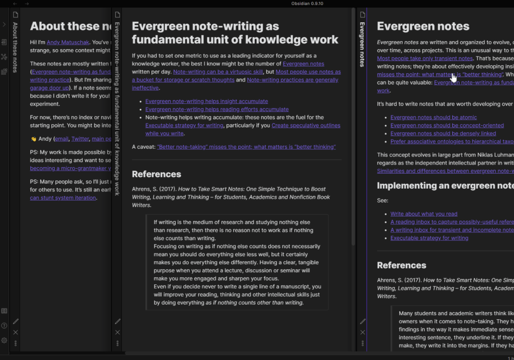
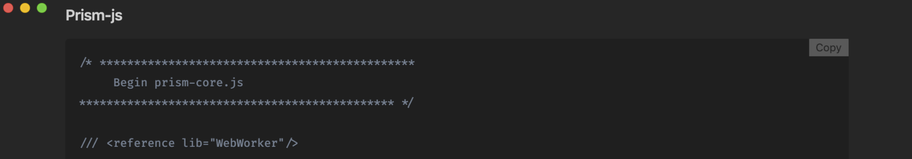

<!-- history area start -->

commit history

<ol>

</ol>

<!-- history area end -->
<!-- toc area start -->

headline

<!-- toc -->

- [list](#list)
- [Sliding Panes (Andy Matuschak Mode)](#sliding-panes-andy-matuschak-mode)
- [Code block copy](#code-block-copy)
- [Show Whitespace](#show-whitespace)
- [番外編よさそうなプラグイン](#%E7%95%AA%E5%A4%96%E7%B7%A8%E3%82%88%E3%81%95%E3%81%9D%E3%81%86%E3%81%AA%E3%83%97%E3%83%A9%E3%82%B0%E3%82%A4%E3%83%B3)

<!-- tocstop -->

<!-- toc area end -->

# list

- Sliding Panes (Andy Matuschak Mode) Obsidian Plugin
- Code block copy Obsidian Plugin
- Show Whitespace Obsidian Plugin

# Sliding Panes (Andy Matuschak Mode)

ファイル名の表示が縦向きに表示されます。かっこいい！

# Code block copy

コードブロック右上にコピーボタンが付きます。かっこいい！

# Show Whitespace

半角スペースとタブの違いが視覚化されて見やすくなります

# 番外編よさそうなプラグイン

調べてないので名前だけ

- calendar
  - その日に書いたdaily noteの数がcalendar上で把握できます
- Advanced Tables
  - markdownで書いたテーブルが見やすくなります
- Obsidian git
  - obsidianをgitで同期的に管理してくれます

