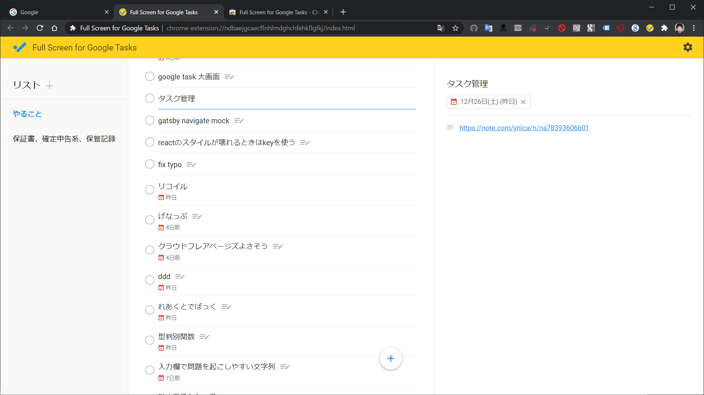

<!-- history area start -->

commit history

<ol>

</ol>

<!-- history area end -->
<!-- toc area start -->

headline

<!-- toc -->

- [拡張機能](#%E6%8B%A1%E5%BC%B5%E6%A9%9F%E8%83%BD)
- [実際の画面](#%E5%AE%9F%E9%9A%9B%E3%81%AE%E7%94%BB%E9%9D%A2)
- [何がいいのか](#%E4%BD%95%E3%81%8C%E3%81%84%E3%81%84%E3%81%AE%E3%81%8B)
- [問題点](#%E5%95%8F%E9%A1%8C%E7%82%B9)

<!-- tocstop -->

<!-- toc area end -->

# 拡張機能
[Full Screen for Google Tasks](https://chrome.google.com/webstore/detail/full-screen-for-google-ta/ndbaejgcaecffnhlmdghchfehkflgfkj?hl=en)

# 実際の画面

# 何がいいのか
- タスク一覧が常に見える
- Google taskと同期できる
- 無料で使える
- 全画面なので見やすい
- 別タブで開かれる

# 問題点
- ないかな

全画面でGoogle Tasksを使いたかったんだ！という方は使ってみてください

